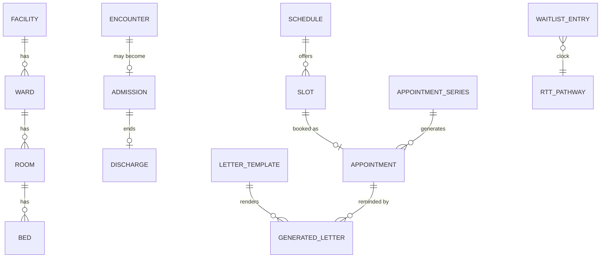

# 5. Domain model

Authoritative field-level detail is in the server's [`spec.md`](../patient-administration-system-with-rust/spec.md) and `src/models/`. This chapter fixes the vocabulary and the rules other chapters rely on.

```mermaid
erDiagram
    FACILITY ||--o{ WARD : has
    WARD ||--o{ ROOM : has
    ROOM ||--o{ BED : has
    ENCOUNTER ||--o| ADMISSION : "may become"
    ADMISSION ||--o| DISCHARGE : ends
    SCHEDULE ||--o{ SLOT : offers
    SLOT ||--o| APPOINTMENT : "booked as"
    APPOINTMENT_SERIES ||--o{ APPOINTMENT : generates
    WAITLIST_ENTRY }o--|| RTT_PATHWAY : "clock"
    LETTER_TEMPLATE ||--o{ GENERATED_LETTER : renders
    APPOINTMENT ||--o{ GENERATED_LETTER : "reminded by"
```

People are not modelled here. Rows carry `person_id` (patient) and `worker_id` (staff) from the upstream services.

## Appointment status

`proposed → booked → arrived → fulfilled`, with `cancelled` and `no_show` as terminal states. A transition to the same state, or out of a terminal state, MUST be rejected.

## Referral status (PCC-2)

A referral has six states. `received` is where every referral starts; `closed`, `returned_with_advice` and `redirected` are final. The code holds the table as `referrals::is_legal_move`, and the database test `every_move_of_the_lifecycle_table_is_allowed_or_refused_as_written` tries every from-state against every move through the real operations.

| From | Legal moves (operation) | Refused |
|---|---|---|
| `received` | `waitlisted` (waitlist), `booked` (book), `closed` (close), `returned_with_advice` or `redirected` (triage) | back to `received` |
| `waitlisted` | `booked` (book), `closed` (close) | waitlisted again, triage, back to `received` |
| `booked` | `closed` (close) | booked again, waitlisted, triage |
| `closed`, `returned_with_advice`, `redirected` | none | every move |

Rules behind the table:

- Triage happens once and only on a referral just received (NEW-11); a redirect creates the replacement referral in the same transaction, so the patient is never left without one.
- A booked referral can still be closed. That is the one move out of `booked`, and it is not the same thing as a cancelled appointment: cancelling the appointment does not change the referral's status today.
- **The guide's edge rules we do not have** (a decline after acceptance, a cancel request that loses to an outcome that arrived first, a no-show that rebooks or ends the referral, a deferred referral that resumes). They need states we do not hold, and a no-show or a cancelled appointment does not touch the referral today. Whether a service wants them is PCC-3, and it is asked of a referral-handling service, not decided from a draft guide.
- A booked referral can still be closed. That is the one move out of `booked`.

The guide (PatientCareCoordination, a draft proof of concept) has twelve states: `requested`, `accepted`, `declined`, `information_requested`, `redirected`, `deferred`, `appointment_booked`, `no_show`, `interim_report`, `cancel_requested`, `cancelled`, `completed`. Mapping, as I read it and not checked against IHE 360X:

| Guide state | Here |
|---|---|
| `requested` | `received` |
| `appointment_booked` | `booked` (and `waitlisted` before it, which the guide has no state for) |
| `redirected` | `redirected` |
| `completed`, `cancelled` | `closed` (one state; the reason is in the audit log) |
| `declined`, `information_requested` | nearest is `returned_with_advice` |
| `accepted`, `deferred`, `no_show`, `interim_report`, `cancel_requested` | none |

We receive and triage referrals; we do not tell the sender (PCC-4).

## Delivery channels

`print` (postal letter), `email`, `sms`, `whatsapp`, `apple_messages`, `portal`. A template lists its channels in preference order.

| Channel | Recipient | Delivered when |
|---|---|---|
| `print` | none | an operator marks the letter sent |
| `email` | patient's email | the email sender accepts it |
| `sms`, `whatsapp` | patient's phone | the sender accepts it |
| `apple_messages` | phone, else email | the sender accepts it |
| `portal` | none (the patient signs in) | the moment it is stored |

A letter has status `pending`, `sent` or `failed`. A `sent` or `pending` letter for an appointment and template means that appointment has been reminded.

## Template variables

`patient` (the upstream person), `appointment` (`id`, `start`, `end`, `reason`) for reminders, and `portal_url` when `PAS_PORTAL_URL` is set.
